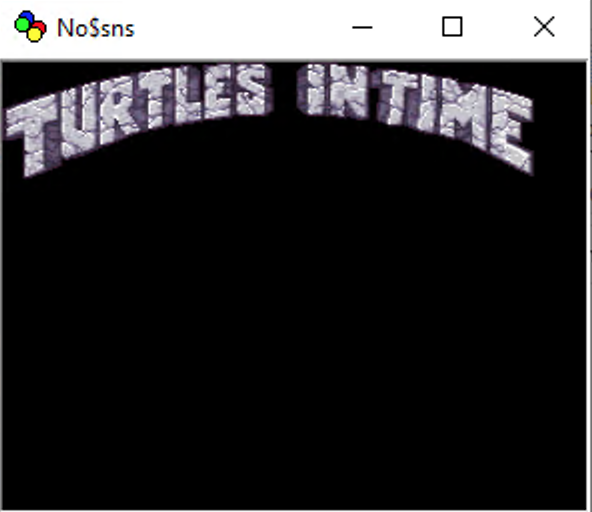

# SNES Logo

## Description
This is a demo for the Super Nintendo and Super Famicom.\
It shows how to load a logo bmp for the SNES console.\
It is built with PVSnesLib.

## Preview

## How to build
### Visual Studio Code
- Install Visual Studio Code
- Open the root directory with Visual Studio Code
- Build: Shit+Ctrl+B
- Open sneslogo.sfc with a SNES Emulator

### Programmer's Notepad
- Install Programmer's Notepad: https://github.com/alekmaul/pvsneslib/wiki/PVSneslib-and-Programmer-Notepad
- Open sneslogo.pnproj with Programmer's Notepad
- Click on Tools>make in the top menu
- Open sneslogo.sfc with a SNES Emulator

## PVSnesLib Documentation
http://www.portabledev.com/pvsneslib/doc/

## smconv
Options are:

--- Graphics options ---\
-gb               add blank tile management (for multiple bgs)\
-gp               Output in packed pixel format\
-glz              Output in lzss compressed pixel format\
-gs(8|16|32|64)   Size of image blocks in pixels [8]\
\
--- Map options ---\
-m!               Exclude map from output\
-m                Convert the whole picture\
-mp               Convert the whole picture with high priority\
-m7               Convert the whole picture for mode 7 format\
-m5               Convert the whole picture for mode 5 & 6 512 width hires\
-mc               Generate collision map only\
-ms#              Generate collision map only with sprites table\
                   where # is the 1st tile corresponding to a sprite (0 to 255)\
-mn#              Generate the whole picture with an offset for tile number\
                   where # is the offset in decimal (0 to 2047)\
-mR!              No tile reduction (not advised)\
-m32p             Generate tile map organized in pages of 32x32 (good for scrolling)\
-me               Convert the map for PVSneslib map engine\
-mt(filename)     Tileset picture filename (PNG,BMP,PCX) for PVSneslib map engine matching\
\
--- Palette options ---\
-p!               Exclude palette from output.\
-pc(4|16|128|256) The number of colors to use [256]\
-po#              The number of colors to output (0 to 256) to the filename.pal\
-pe#              The palette entry to add to map tiles (0 to 16)\
-pr               Rearrange palette, and preserve palette numbers in the tilemap\
-pR               Palette rounding\
\
--- File options ---\
-f[bmp|pcx|tga|png]   convert a bmp or pcx or tga or png file [bmp]\
\
--- Misc options ---\
-n                no border\
-q                quiet mode\
-v                Display gfx2snes version information\
